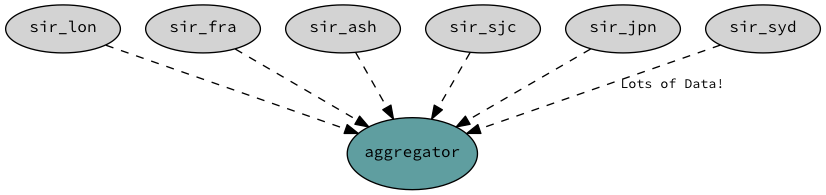

===================
Global Architecture
===================

Although each agent is meant to run independently the API allows you to combine/aggregate data from multiple locations
and take global decisions.

Once you have a global view of your global network and your traffic patterns you can do things like:

* Send users to a location where you know you are peering with the network that user belongs to.
* Redirect users to another POP where his/her network is reachable.
* Redirect users based on cost, latency, bandwidth or any other metric.
* Predict your global traffic patterns and optimize your capacity.
* Build reports to see who you should be peering with.
