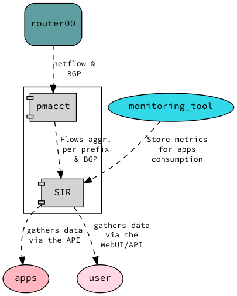

==================
Local Architecture
==================

The local architecture of the SIR agent is quite simple:

There are two main components:

* `pmacct <http://www.pmacct.net/>`_ - This is a flow collector that is going to get BGP and flow information from your routers.
* **SIR** - This code is going to do some analytics with the data collected by pmacct and expose it to apps/users via the WebUI and the API.

Users and applications can consume the data exposed by SIR and take peering or traffic engineering decisions.
Applications and users can also store data in the agent. This is useful if you want to influence the behavior of
some other applications later on.
