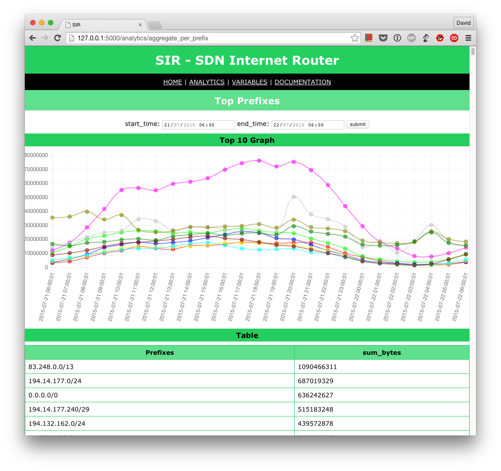
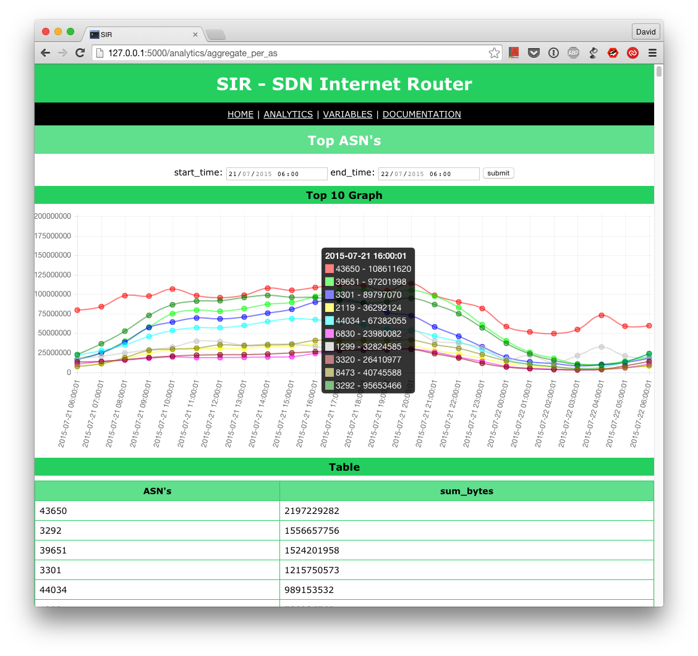
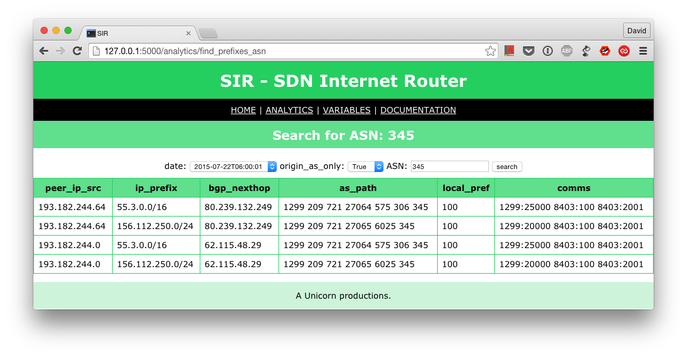
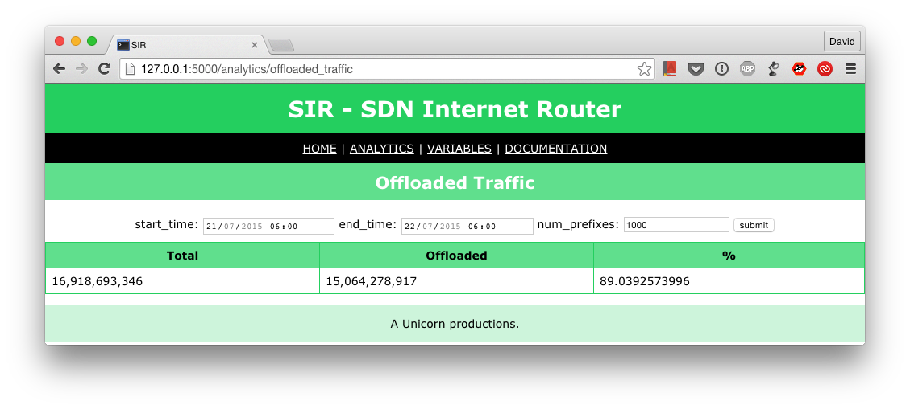
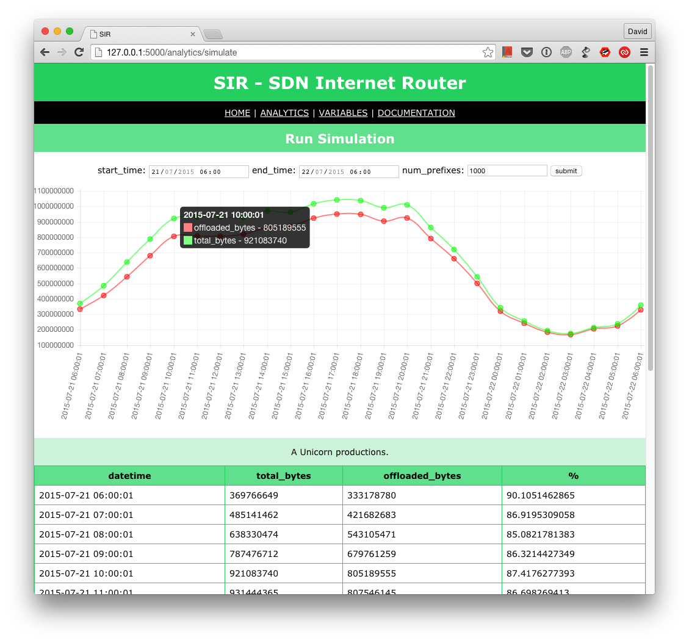

#########
Analytics
#########

Top Prefixes
------------

You can get the top N prefixes for a given period of time.

Top ASN's
---------

You can get the top ASN's for a given period of time.

Search Prefixes
---------------

You can search for any prefix of any prefix-length and get back all the possible routes that you could choose to reach
it. You will not get only the longest prefix match but all the possible matches.

.. image:: search_prefix.png
    :align: center
    :alt: search_prefix

.. note:: ``peer_ip_src`` is useful if you are sending data to the agent from different routers as it shows the IP of
          the router that provided those prefixes

Search ASN's
------------

You can search for any ASN and see all the prefixes that either traverse and/or originated in that ASN. Set the option
``origin_as_only`` to indicate if you want to see only prefixes originated in that ASN or if you want prefixes transiting
that ASN as well.

.. note:: ``peer_ip_src`` is useful if you are sending data to the agent from different routers as it shows the IP of
          the router that provided those prefixes

Offloaded Traffic
-----------------

For a given period of time and a number of prefixes N, returns the amount of traffic matched if you had only the top N
prefixes installed in the FIB vs the Total Traffic.

Simulate FIB Optimization
-------------------------

For a given period of time and a number of prefixes N, simulates how the switch/router would perform if you had only
the top N prefixes installed in the FIB vs the Total Traffic.

