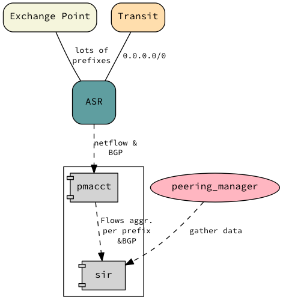

========
Scenario
========

We want to deploy the SIR agent connecting with an ASR to add some visibility to our edge router. This visibility will allows us to understand who we are sending traffic with and to who peer with.

We can't run code in the ASR's so we are going to deploy the agent on a linux machine in the Datacenter. This shouldn't be an issue as both BGP and netflow can be sent to a device that is not directly connected.

