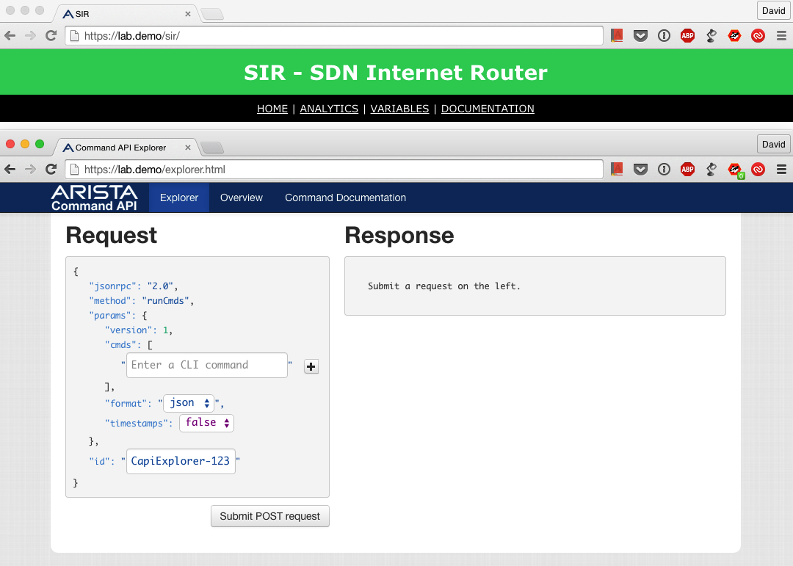

.. _accessing_sir:

=============
Accessing SIR
=============

To access SIR you just have to go the same URL you would access the eAPI and add /sir/. For example, if the URL to
access the eAPI is ``https://lab.demo/`` you can access SIR with ``https://lab.demo/sir/``.

