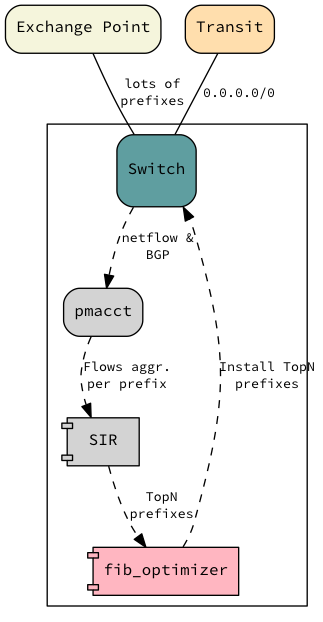

========
Scenario
========

We want to deploy the SIR agent inside an Arista switch. All the code will be run inside the same switch (no external
server will be needed). To run the application and present it to the user we will use the same application/HTTP server
that the eAPI is using.

This will give us extra visibility on how we are using the Arista switch and do smart things like optimizing the fib or
take peering decisions.

