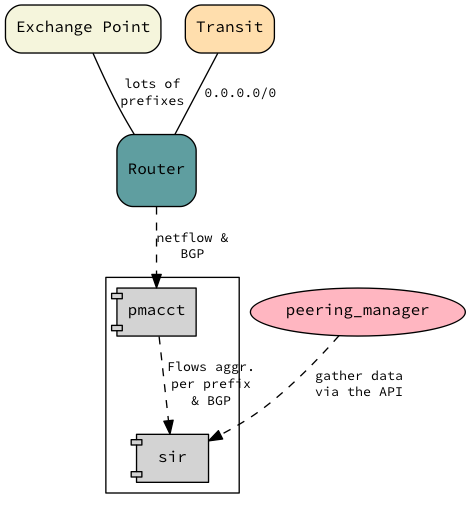

========
Scenario
========

We want to deploy the SIR agent connecting with a generic router to add some visibility to our edge router. This
visibility will allows us to understand who we are sending traffic to and who to peer with.

We can't run code in the generic router so we are going to deploy the agent on a linux machine in the Datacenter. This
shouldn't be an issue as both BGP and netflow/sflow can be sent to a device that is not directly connected to the router.

Per se this is not very interesting, however, if you have a large network with several POPs, having this agent on each
location would give you a nice way of gathering and aggregating data.
