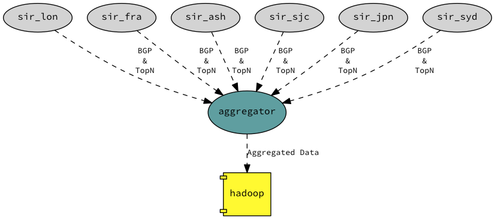

A Software Defined Content Delivery Network
===========================================

As mentioned in the global architecture you can aggregate the data exposed by SIR. With that data you could start seeing
global traffic patterns, understand where your users are coming from and where you could send them based on several
metrics like cost, capacity, latency, etc...

