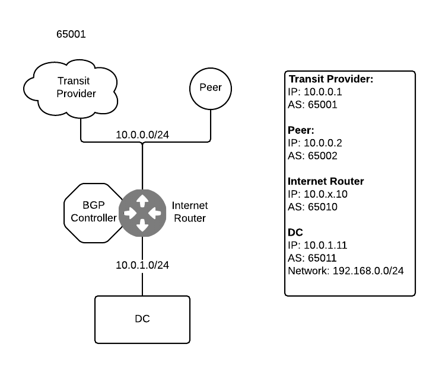

***********
First Steps
***********

============
Introduction
============

Despite of what it might look on a first glance, once you understand everything involved, you will see it's quite simple to deploy this SDN Internet Router. In brief, what you have to do is:

#. Deploy your network
#. Configure `pmacct <http://www.pmacct.net/>`_ (flow collector)
#. Install and configure the BGP controller

You have to do the first step anyway and you probably are doing the second step, although you might be using a different collector. So, in fact, the only extra step is setting up the BGP Controller and that's, by far, the easiest step.

============
Requirements
============

To setup everything you will need the following:

* A router/switch that supports *selective route dowload*
* Somewhere to run *pmacct* and the *BGP Controller*. It can be a linux host or a router/switch where you can install your own software like Arista or a Cumulus based switch.

========
Scenario
========

For our example we are going to assume the following network diagram:

Our Internet Router is connected to:

- **Transit provider** - Our transit provider will send the default route only
- **Peer** - Peers will send a bunch of prefixes. For the sake of simplicity we have only one peer and it´s on the same network as the Transit Provider.
- **DC** - From the DC we will get the network where our servers are located.

In addition we will forward the following information:

- We will readvertise the networks coming from the **DC** to our **Transit Provider** and our **peers**
- We will readvertise the default route to our **DC**

Using a router running *bird* the configuration will be as follows (when installing *bird* make sure you are using a recent version of the software)::

    # This file includes the allow_prefixes() method, which will
    # decide which prefixes to install on the routing table.
    include "/etc/bird/allow_prefixes.bird";

    router id 10.0.0.10;
    log syslog all;
    debug protocols all;

    listen bgp address 10.0.0.10 port 179;
    listen bgp address 10.0.1.10 port 179;

    # protocol kernel will control which routes go from the RIB to the FIB
    protocol kernel {
        export filter {
            # We accept the routes coming from our Transit Provider
            if from = 10.0.0.1 then accept;
            # We also accept everything coming from our DC
            if from = 10.0.1.11 then accept;
            # This method is what the BGP controller will update later
            if allow_prefixes() then accept;
            # The rest is rejected.
            reject;
        };
    }

    protocol device {
        scan time 10;
        primary 10.0.0.0/24;
        primary 10.0.1.0/24;
    }

    # Transit Provider
    protocol bgp {
        local as 65010;
        neighbor 10.0.0.1 as 65001;

        export filter {
            if from = 10.0.1.11 then accept;
            reject;
        };
    }

    # Peer
    protocol bgp {
        local as 65010;
        neighbor 10.0.0.2 as 65002;

        export filter {
            if from = 10.0.1.11 then accept;
            reject;
        };
    }

    # DC
    protocol bgp {
        local as 65010;
        neighbor 10.0.1.11 as 65011;

        export filter {
            # We only want to send the default route to the DC
            if net = 0.0.0.0/0 then accept;
            reject;
        };
    }

In addition you will have to create the file */etc/bird/allow_prefixes.bird* with the following content::

    function allow_prefixes()
    {
      return net ~ [
        # Dummy prefix that you will surely not have in your RIB.
        # The reason for this is that the list cannot be empty.
        1.2.3.4/32
      ];
    }

Let´s see if this is working::

    # We start the service
    $ sudo service bird start
    [ ok ] Starting BIRD Internet Routing Daemon (IPv4): bird.

    # We connect to bird
    $ sudo birdc

    # Routes from the Transit Provider
    bird> show route protocol bgp1
    0.0.0.0/0          via 10.0.0.1 on eth1 [bgp1 10:36] * (100) [AS65001i]

    # Routes from the Peer
    bird> show route protocol bgp2
    188.3.176.0/21     via 10.0.0.2 on eth1 [bgp2 10:36] * (100) [AS65002i]
    194.3.206.0/24     via 10.0.0.2 on eth1 [bgp2 10:36] * (100) [AS65002i]
    212.5.192.0/19     via 10.0.0.2 on eth1 [bgp2 10:36] * (100) [AS65002i]
    194.8.226.0/23     via 10.0.0.2 on eth1 [bgp2 10:36] * (100) [AS65002i]
    ...

    # Routes from the DC
    bird> show route protocol bgp3
    192.168.0.0/24     via 10.0.1.11 on eth2 [bgp3 10:36] * (100) [AS65011i]

    # Routes to the Transit Provider and the Peer
    bird> show route export bgp1
    192.168.0.0/24     via 10.0.1.11 on eth2 [bgp3 10:36] * (100) [AS65011i]
    bird> show route export bgp2
    192.168.0.0/24     via 10.0.1.11 on eth2 [bgp3 10:36] * (100) [AS65011i]

    # Routes to the DC
    bird> show route export bgp3
    0.0.0.0/0          via 10.0.0.1 on eth1 [bgp1 10:36] * (100) [AS65001i]

    # Routes installed on the FIB
    bird> show route export kernel1
    0.0.0.0/0          via 10.0.0.1 on eth1 [bgp1 10:36] * (100) [AS65001i]
    192.168.0.0/24     via 10.0.1.11 on eth2 [bgp3 10:36] * (100) [AS65011i]

As you can see we are doing exactly what we described before. So far, the routes coming from our **Peer** are just being ignored. We are not installing them on the FIB.

==============================
Configuring the BGP controller
==============================

We are going to run the BGP controller inside the **Internet Router**. You can run it outside if you prefer or if you can´t install software on your switch.

-----------------------------
Preparing the Internet Router
-----------------------------

^^^^^^^^^^^^^^^^^^^
Netflow/sFlow Agent
^^^^^^^^^^^^^^^^^^^

Before we start, you will need a sFlow/Netflow/IPFIX agent that can talk with pmacct. Configuring this agent is out of the scope of this document. You should be able to find enough documentation on the Internet on how to do this with your network device.

^^^^^^^^^^^^^^^
Configuring BGP
^^^^^^^^^^^^^^^

We will have to update bird configuration in order to peer with pmacct. Doing that is very simple. Just add the following configuration to the file **/etc/bird/bird.conf** (you will probably have to update the IP's and the AS's)::

    #Pmacct
    protocol bgp {
        local as 65010;

        # As we are running pmacct on the same host we specify a different TCP port
        # In addition, pmacct works as an iBGP neighbor
        neighbor 10.0.1.10 port 1179 as 65010;

        # This will enable ADD-PATHs. If we have two routes for the same prefix
        # we will send all paths to pmacct instead of sending only the best path
        add paths tx;

        export filter {
            # We only want to send the prefixes coming from the peers
            if from = 10.0.0.2 then accept;
            reject;
        };
    }

^^^^^^^^^^^^^^^^^
Installing pmacct
^^^^^^^^^^^^^^^^^

Next step is to install and configure pmacct. To install pmacct do the following::

    $ sudo apt-get install libpcap-dev make gcc libjansson-dev
    $ wget http://www.pmacct.net/pmacct-1.5.0.tar.gz
    $ tar xvzf pmacct-1.5.0.tar.gz
    $ cd pmacct-1.5.0/
    $ sudo mkdir -p /spotify/pmacct
    $ ./configure --prefix=/spotify/pmacct --enable-jansson
    $ make
    $ sudo make install

Finally, pmacct configuration might slightly differ depending on the protocol you are using to report flow statistics. In my example I am running fProbe as a netflow agent so I will be using netflow. We will need two files:

* **/spotify/pmacct/etc/nfacctd.conf**::

    daemonize: True

    # The next block will make pmacct to write a file every hour containing the data for the past hour
    # In addition, there will be a file called simpleoutput-latest.txt with the latest data.
    plugins: print[simpleoutput]
    print_output_file[simpleoutput]: /spotify/pmacct/output/flows/simpleoutput-%Y%m%d-%H%M.txt
    print_latest_file[simpleoutput]: /spotify/pmacct/output/flows/simpleoutput-latest.txt
    files_umask: 022
    print_output[simpleoutput]: csv
    print_output_separator[simpleoutput]: ;
    print_refresh_time[simpleoutput]: 3600
    print_output_file_append[simpleoutput]: true
    print_history[simpleoutput]: 60m
    print_history_roundoff[simpleoutput]: h

    aggregate: dst_net, dst_mask

    bgp_daemon: true
    bgp_daemon_ip: 10.0.1.10
    # As we are running pmacct on the same Internet Router we specify the port
    # If you are running pmacct on a dedicate machine you can skip this
    bgp_daemon_port: 1179
    bgp_daemon_max_peers: 2
    bgp_agent_map: /spotify/pmacct/etc/agent_to_peer.map
    bgp_table_dump_file: /spotify/pmacct/output/bgp/bgp-$peer_src_ip-%H%M.txt
    bgp_table_dump_refresh_time: 3600

    nfacctd_as_new: bgp
    nfacctd_net: bgp
    # Port and IP to bind pmacct
    nfacctd_port: 9996
    nfacctd_ip: 127.0.0.1

* **/spotify/pmacct/etc/agent_to_peer.map**::

    # id=$BGP_ROUTER_ID_INTERNET ROUTER ip=$SRC_IP_FOR_NETFLOW_MESSAGES
    id=10.0.0.10	ip=127.0.0.1

Now you can start pmacct and check that it works::

    # Start pmacct
    $ sudo /spotify/pmacct/sbin/nfacctd -f /spotify/pmacct/etc/nfacctd.conf
    WARN ( default/core ): Daemonizing. Hmm, bye bye screen.

    # Check that BGP is up
    $ sudo birdc
    BIRD 1.4.5 ready.
    bird> show protocols bgp4
    name     proto    table    state  since       info
    bgp4     BGP      master   up     18:31:28    Established

After an hour you should have data::

    # Flow information
    $ ls /spotify/pmacct/output/flows
    simpleoutput-20141129-1800.txt  simpleoutput-latest.txt

    # BGP information
    $ ls /spotify/pmacct/output/bgp
    bgp-10_0_1_10-1800.txt

^^^^^^^^^^^^^^^^^^^^^^^^^^^^^
Installing the BGP Controller
^^^^^^^^^^^^^^^^^^^^^^^^^^^^^

First step is to clone the GIT repository and install the requirements::

    $ git clone git@github.com:dbarrosop/sir.git
    $ cd sir
    $ pip install -r requirements.txt

Then you will need a configuration file with a content similar to the following::

    max_age: 48 # Maximum age a route can be present without any traffic
    csv_delimiter: ";" # Delimiter used by pmacct on the CSV file
    max_routes: 1500 # Maximum routes you can support
    min_bytes: 0 # Min bytes necessary to consider a prefix eligible
    packet_sampling: 10000 # Packet sampling configured on the flow agent

    # Where to get the latest file from pmmact. Used in "run" mode
    pmacct_data_file: '/spotify/pmacct/output/flows/simpleoutput-latest.txt'
    # Where all the files are located. Used in "simulate" mode
    pmacct_data_folder: '/spotify/pmacct/output/flows'
    # Where pmacct stores the BGP feed
    pmacct_bgp_folder: '/spotify/pmacct/output/bgp'

    # List of plugins to run
    plugins:
      - 'prefix_data.SavePrefixData'
      - 'statistics.RouteStatistics'
      - 'statistics.OffloadedBytes'
      - 'bird.Bird'

    # Used by plugin prefix_data.SavePrefixData. See more details on the plugin documentation.
    latest_data_file: '/spotify/sir_data/latest_data.csv'
    preserve_data_files: False

    # Used by plugin statistics.RouteStatistics. See more details on the plugin documentation.
    route_statistics_file: '/spotify/sir_data/route_statistics.csv'
    route_statistics_png_file: '/spotify/sir_data/route_statistics.png'

    # Used by plugin statistics.OffloadedBytes. See more details on the plugin documentation.
    draw_offloaded_bytes_file: '/spotify/sir_data/offloaded_bytes.csv'
    draw_offloaded_bytes_png_file: '/spotify/sir_data/offloaded_bytes.png'

    # Used by plugin bird.Bird. See more details on the plugin documentation.
    bird_policy_file: '/etc/bird/allow_prefixes.bird'

Where you keep the file is up to you, I will use **/etc/sir-conf.yaml**. Make sure that the folder where you are going to store some statistics and graphs exists, **/spotify/sir_data/** in my configuration example. Now it´s time to run it and see if it works::

    # We check the routing table first
    $ sudo ip route | grep bird
    192.168.0.0/24 via 10.0.1.11 dev eth2  proto bird

    # We run the controller
    $ python /spotify/sir/bgpc.py run -c /etc/sir-conf.yaml
    BIRD 1.4.5 ready.
    Reading configuration from /etc/bird/bird.conf
    Reconfigured

    # If we don´t get any error we check the routing table and the content of the directory /spotify/sir_data/
    $ ip route | grep bird
    130.239.0.0/16 via 10.0.0.2 dev eth1  proto bird
    185.31.17.0/24 via 10.0.0.2 dev eth1  proto bird
    192.30.252.0/24 via 10.0.0.2 dev eth1  proto bird
    192.168.0.0/24 via 10.0.1.11 dev eth2  proto bird
    195.20.224.0/19 via 10.0.0.2 dev eth1  proto bird
    $ ls /spotify/sir_data/
    latest_data.csv      offloaded_bytes.png   route_statistics.png
    offloaded_bytes.csv  route_statistics.csv

Now you have to make sure you run the controller every hour after pmacct has saved the data on disc. To do that you can add a cron task, create the file **/etc/cron.d/sir** with the content::

    5 * * * *   root    /usr/bin/env python /spotify/sir/bgpc.py run -c /etc/sir-conf.yaml
