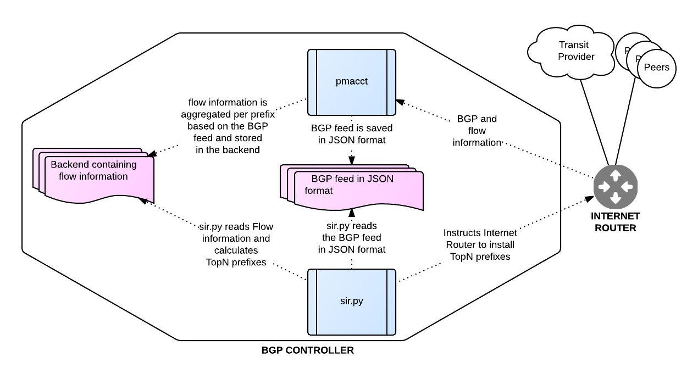

============
Introduction
============

The BGP controller consists of two different pieces:

* **The Internet Router** - This is the router itself. You can use any router or L3 switch you want. The only requisites are:

    - It must support *selective route download*.
    - Must be able to export flow information to `pmacct <http://www.pmacct.net/>`_.

* **The BGP Controller** - The BGP controller will gather data from the Internet Router (like the BGP feed and flow statistics) and will instruct the Internet router which prefixes to install on the FIB. The BGP controller consists of two software pieces:

    - `pmacct <http://www.pmacct.net/>`_ - Which will collect flows information and the BGP feed from the Internet Router to aggregate flows per BGP prefix.
    - **sir** - Which will use the information generated by `pmacct <http://www.pmacct.net/>`_ to calculate the TOP BGP prefixes in our network and do different stuff like telling the Internet Router which prefixes to install on the FIB.

